*The future isn't humans vs AI. It's humans, **finished** by AI.*

## 👋 Hi, I'm Chandrima
🎓 Master's student in **Robotics & AI at IIT Guwahati** · 💼 Junior Data Scientist at **Calsoft** · ⚛️ ML research with the **Saha Institute of Nuclear Physics**
📡 Noise is loud. Signal is patient. &nbsp;·&nbsp; 🧩 Progress is a thousand small gaps, closed. &nbsp;·&nbsp; 🌗 Between the blank page and the broken one, I work on both.

## ⚡ What I Can Do
<table>
<tr>
<td width="33%" valign="top">

**🤖 Machine Learning** 
Classical ML from scratch, SVMs, logistic regression, AutoML pipelines, model validation

</td>
<td width="33%" valign="top">

**👁️ Computer Vision** 
YOLOv8 detection, OCR, stereo depth estimation, image & video pipelines

</td>
<td width="33%" valign="top">

**🧠 LLMs & Gen AI** 
RAG systems, LangChain, LLM-assisted feature selection and error correction

</td>
</tr>
<tr>
<td valign="top">

**📈 Signal Processing** 
STFT feature extraction, pulse localization, physics-grade classification

</td>
<td valign="top">

**📊 Data & BI** 
Cleaning real-world data, EDA, Power BI dashboards that drive product decisions

</td>
<td valign="top">

**🌐 Ship It** 
Interactive web dashboards, in-browser ML, Flask apps, Netlify deployments

</td>
</tr>
</table>

## 🎓 Education &nbsp;·&nbsp; 💼 Experience
<table>
<tr>
<td width="45%" valign="top">

### 🏛️ IIT Guwahati
**Master's — Robotics & Artificial Intelligence** 
 <code>Ongoing</code>

**RCC Institute of Information Technology** 
B.Tech — Electronics & Communication · <code>CGPA 8.2</code>

</td>
<td width="55%" valign="top">

**Junior Data Scientist** · Calsoft Inc. <code>Dec 2025 – Present</code> 
Data cleaning & analysis on real-world datasets · Power BI dashboards for product decisions

**Thesis Researcher** · Saha Institute of Nuclear Physics <code>Mar 2025 – Jul 2026</code> 
End-to-end n/γ classification pipeline · STFT features · LR & SVM up to 100% accuracy

**AI–ML Intern** · Calsoft Inc. <code>Jun 2025 – Dec 2025</code> 
ML, deep learning & LLM solutions in Python · model and dashboard validation

</td>
</tr>
</table>

## 📄 Publication
**Machine Learning–Based Discrimination of Neutron and Gamma-Ray Induced Acoustic Signals in Superheated Liquid Detectors** — *with SINP* 

## 🚀 Featured Projects
<table>
<tr>
<td width="50%" valign="top">

### 🧭 Gradient Atlas
**Learn ML by building it, not memorising it.** 24 chapters of classical ML as an explorable map, study route, live console and flashcards. Write each algorithm in plain Python, then check it against scikit-learn.

 

</td>
<td width="50%" valign="top">

### ⚛️ InDEx n/γ Discrimination
**A neutron's acoustic signature vs a gamma-ray's.** Built with SINP for a superheated-liquid dark-matter detector: pulse localization, 512-D STFT features, LR & SVM from scratch on the real 200-event dataset. Drop in a waveform and it classifies **in your browser**.

 

</td>
</tr>
</table>

## 🛠️ More Projects
<table>
<tr>
<td width="50%" valign="top">

**🚗 ANPR — Number Plate Recognition** 
Reads Indian number plates from images and video: YOLOv8 detects vehicles & plates, OCR reads them, an LLM cross-check fixes look-alike characters. Also detects vehicle type and colour. 

</td>
<td width="50%" valign="top">

**📚 Marginalia — RAG Q&A** 
*Ask the document, not the internet.* Upload a PDF and get answers grounded only in its most relevant passages. 

</td>
</tr>
<tr>
<td width="50%" valign="top">

**👁️ StereoVision Pro** 
Depth and distance from stereo image pairs using SGBM disparity and camera EXIF data, shown as an interactive heatmap. 

</td>
<td width="50%" valign="top">

**🏗️ Construction Copilot** 
*Measured, not guessed.* Ask distribution boards, building plans and circuits anything in plain English. Every number is measured from the DXF and every rule is cited from the spec PDF, with pass/fail compliance checks. Runs online or fully offline on desktop. 

</td>
</tr>
</table>
🚧 More robotics, vision and ML repos coming soon — <a href="https://github.com/Chandrima2005?tab=repositories">browse all repositories</a>.

## 🧰 Tech Stack

 
Machine Learning · LLMs · Gen AI · LangChain · RAG · NumPy · Pandas · Matplotlib · Power BI · Gemini

